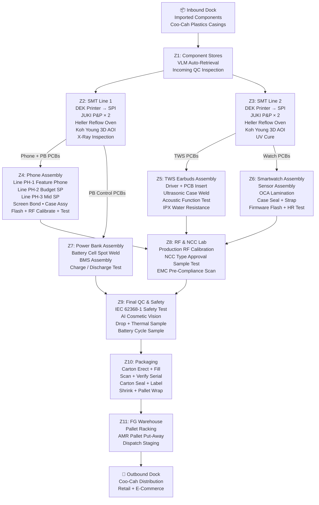
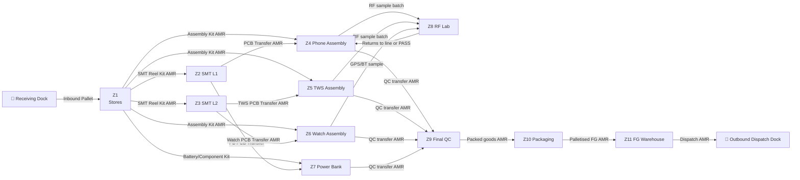

# Personal Electronics Factory — Factory Floor Plan & Production Flow

> **Project Coo-Cah | AI-Powered Manufacturing Ecosystem**
> **Factory:** Coo-Cah Personal Electronics Factory | **Location:** Sagamu Industrial Estate, Ogun State | **Phase:** Phase 1
> **Document Version:** 1.0 | **Owner:** Industrial Engineering Team

---

## 1. Facility Overview

| Parameter                 | Value                                                        |
|---------------------------|--------------------------------------------------------------|
| Total Site Area           | ~40,000 m² (enclosed factory + yard)                        |
| Total Enclosed Floor Area | ~18,000 m²                                                   |
| Number of Floors          | 1 (single-storey; mezzanine offices above stores)           |
| Clear Ceiling Height      | 8.0 m (production); 10.0 m (FG warehouse)                  |
| Column Grid               | 12 m × 12 m standard grid                                   |
| Floor Specification       | ESD-safe epoxy resin floor throughout production zones       |
| Zoning                    | 10 production zones + 2 support zones + FG warehouse        |

---

## 2. Zone Layout Plan

### 2.1 Zone Overview Table

| Zone | Zone Name                             | Area (m²) | Key Equipment                                        |
|------|---------------------------------------|-----------|------------------------------------------------------|
| Z1   | Inbound Goods / Component Stores      | 1,800     | Racking, VLMs ×4, incoming QC desk                  |
| Z2   | SMT Line 1 (Phone / Power Bank PCBs)  | 800       | DEK printer, JUKI FX-3R, RX-7, Heller oven, AOI     |
| Z3   | SMT Line 2 (TWS / Watch PCBs)         | 800       | DEK printer, JUKI FX-3R, RX-7, Heller oven, AOI     |
| Z4   | Phone Assembly Lines (PH-1, PH-2, PH-3) | 2,200   | Screen bond, case assembly, screwing, flash, test    |
| Z5   | TWS Earbuds Assembly Line             | 800       | Driver assembly, ultrasonic weld, acoustic test      |
| Z6   | Smartwatch Assembly Line              | 700       | Watch assembly, OCA laminator, pressure test         |
| Z7   | Power Bank & Accessories Line         | 600       | Spot weld, BMS assembly, charge/discharge test       |
| Z8   | RF & NCC Type Test Laboratory         | 700       | Shielded chambers ×4, R&S CMW500, OTA range          |
| Z9   | Final QC & Safety Test Lab            | 600       | Drop test, thermal chamber, AI cosmetic vision       |
| Z10  | Packaging Lines                       | 800       | Carton erect, fill, seal, pallet wrap                |
| Z11  | Finished Goods Warehouse              | 3,500     | Selective pallet racking, AMR pallet lanes           |
| Z12  | Engineering, MES & Offices            | 900       | MES servers, engineering desks, canteen mezzanine    |
| —    | Utility / Energy Room                 | 600       | PCS room, MCC, ATS, compressors                      |
| —    | Amenities, First Aid, Locker Rooms    | 500       | Welfare facilities — north block                     |
| —    | Aisles, Circulation, Walls            | 2,200     | AMR lanes (2m wide), emergency egress corridors      |
| **Total** |                                  | **18,000**|                                                      |

### 2.2 Zone Adjacency Rationale

- **Z1 (Stores)** is positioned at the building perimeter adjacent to the receiving dock, feeding both SMT lines (Z2, Z3) and assembly lines (Z4–Z7) directly.
- **Z2 and Z3 (SMT Lines)** are positioned centrally with cleanroom-grade HEPA ventilation, ESD flooring, and direct AMR lanes linking to the assembly zones.
- **Z4 (Phone Assembly)** is the largest single production zone, positioned with natural flow from Z2 (mainboard output) and Z1 (display, battery, casing inputs from Coo-Cah Plastics and imports).
- **Z8 (RF Lab)** is isolated from all production RF emissions by the building's north-east corner location and additional internal RF shielding.
- **Z11 (FG Warehouse)** is at the far end of the building with a dedicated dispatch dock, logically separating inbound from outbound material flows.

---

## 3. Production Flow Diagram

---

## 4. Detailed Zone Descriptions

### Zone Z1 — Inbound Goods & Component Stores

**Area:** 1,800 m² | **Height:** 8 m clear | **Ceiling:** Standard; no ESD treatment needed

The component stores serve as the factory's raw material buffer. Components are stored in three modes:

1. **VLM (Vertical Lift Module) Storage** — 4 × Modula Lift units for SMT component reels (SoC ICs, capacitors, resistors, Bluetooth chips, RF modules). Handles up to 90,000 unique component SKUs with barcode-driven FIFO retrieval.
2. **Bulk Racking** — 200-bay selective pallet racking for boxed components: battery cells, display assemblies, camera modules, and casing sets from Coo-Cah Plastics.
3. **Incoming QC Bench** — Dedicated area for AQL-based incoming quality checks, verifying component quality, quantity, and supplier COC before inward goods scan.

Minimum safety stock targets:
- SoC chips and memory: 6 weeks
- Display modules: 4 weeks
- Battery cells: 4 weeks
- Coo-Cah Plastics casings: 2 weeks (local supplier — shorter lead time)

---

### Zones Z2 & Z3 — SMT Lines 1 & 2

**Area:** 800 m² each | **Height:** 6 m clear | **Floor:** ESD-safe epoxy | **Particle Control:** ISO Class 8 via HEPA

Both SMT lines are laid out as single-direction in-line processes, running parallel to each other in adjacent bays. The line width is 4 m, with 3 m service aisles on each side for maintenance access. Each line is approximately 40 m long end-to-end including loader/unloader and inspection stations.

Process sequence per SMT line:
1. PCB Magazine Loader (auto-feed)
2. Solder Paste Screen Printer (DEK)
3. SPI — 3D Solder Paste Inspection (Koh Young)
4. High-Speed Pick-and-Place (JUKI FX-3R)
5. Flexible Pick-and-Place (JUKI RX-7)
6. Reflow Oven (Heller 1964 MK5 — nitrogen-capable)
7. AOI — Automated Optical Inspection (Koh Young Zenith 3D)
8. X-Ray Inspection (BGA joints — Line 1 only; shared inspection cycle)
9. Selective Soldering (Ersa Versaflow) — through-hole connectors
10. ICT / Flying Probe Tester
11. PCB Depanelling Router
12. PCB Magazine Unloader → AMR transfer to assembly zones

---

### Zone Z4 — Phone Assembly Lines PH-1 / PH-2 / PH-3

**Area:** 2,200 m² | **Height:** 6 m | **Floor:** ESD-safe epoxy throughout

Three parallel assembly lines are arranged in a 3 × sequential-cell U-layout. Each line has 18 operator stations on a 600 mm belt conveyor. Lines PH-1 and PH-2 can be rapidly reconfigured for cross-model production when demand mix shifts. The MES manages build orders and guides operators with on-screen work instructions.

Station sequence (per line):
1. Mainboard kitting from SMT Line 1 + component kits from Z1 AMR delivery
2. PCB placement + FPC connector fit
3. Battery installation (torque log to MES)
4. Camera module install + clip
5. Screen/display installation (pre-bonded in Z4 screen bond station)
6. Rear cover assembly + ultrasonic weld or clip
7. Screw fastening (multi-spindle; torque log to MES)
8. IMEI + serial number flash (MES-linked)
9. Software full flash + configuration (Android baseline)
10. Function test (boot, touch, camera, audio, NFC, charging)
11. RF calibration + NCC lab hand-off sample
12. Display visual inspection (AI vision)
13. Cosmetic final inspection
14. Protective film application + accessory bundle
15. Hand-off to packaging Z10 via AMR

---

### Zone Z5 — TWS Earbuds Assembly Line

**Area:** 800 m² | Handles both CCE-TWS-01 and CCE-TWS-PRO (< 20 min changeover)

Earbuds are assembled at 8 paired workstations arranged in a U-cell. The small form factor requires precision tooling and micro-assembly skills. All operators are trained to IPC-A-610 Class 2 solder acceptability standards. Acoustic testing stations are partially isolated with soft acoustic baffling to reduce ambient noise interference.

---

### Zone Z6 — Smartwatch Assembly Line

**Area:** 700 m² | Handles CCE-SW-LITE and CCE-SW-PRO

Watches require the most precise assembly work in the factory due to tight tolerances in OCA lamination, crown seal insertion, and GPS antenna positioning (Pro model). The OCA vacuum laminator is the only equipment here with cleanroom-grade particle requirements (ISO Class 7 local enclosure around the laminator). The 5 ATM pressure test for Pro models is the final gating test before packaging.

---

### Zone Z7 — Power Bank & Accessories Line

**Area:** 600 m² | Battery cell spot-welding requires a dedicated fire safety zone per NFPA 855 / Nigeria Fire Safety Act

All Li-ion battery welding and assembly operations in Z7 are enclosed by a 2-hour fire-rated partition. A dedicated Novec 1230 fire suppression system covers the spot-welding and cell assembly area. Ventilation is independent of the main factory HVAC, with LEL gas detection (LiPo off-gassing monitoring).

---

### Zone Z8 — RF & NCC Type Test Laboratory

**Area:** 700 m² | RF shielded room-within-a-room construction

The RF lab is constructed with RF shielded panels achieving ≥ 90 dB attenuation from 100 kHz to 18 GHz. Four shielded test chambers are installed: two large (ETS-Lindgren 7000 series) for full-phone OTA testing, and two smaller benchtop chambers for TWS/watch BT/Wi-Fi testing. A compact CATR for OTA TRP/TIS measurements. All RF test equipment is maintained on a calibration schedule traceable to NIST/PTB standards, as required for NCC Type Approval submission documentation.

---

### Zone Z9 — Final QC & Safety Test Laboratory

**Area:** 600 m² | Independent temperature and humidity control

All finished goods undergo final QC sampling before transfer to packaging. Statistical sampling follows ISO 2859-1 (AQL Level II) for cosmetic and functional characteristics. 100% of units receive IEC 62368-1 electrical safety test (hipot + earth bond for power products). The AI cosmetic vision system (Cognex In-Sight 9000) inspects 100% of phone units for scratches, housing gaps, and display defects.

---

### Zone Z10 — Packaging Lines

**Area:** 800 m² | Ambient; no special environmental controls

Two parallel packaging lines with MES serial verification at each stage. Packaging materials sourced from local supplier with Coo-Cah specification. Every carton is weighed by the Mettler Toledo checkweigher, compared against the MES expected weight, and auto-rejected if outside ±30g. Every packed serial number is confirmed in MES as "Packed — Ready for Dispatch."

---

### Zone Z11 — Finished Goods Warehouse

**Area:** 3,500 m² | Height: 10 m clear

The FG warehouse uses 200 bays of selective pallet racking with four dedicated AMR (MiR250) lanes for put-away and pick. Stock management is handled by the MES WMS module with FIFO and FEFO enforcement. Dispatch staging area holds up to 40 pallets in temperature-stable ambient conditions. The cold-chain is not required for any current Personal Electronics Factory products.

---

## 5. AMR Routing Plan

### 5.1 AMR Fleet Summary

| AMR Group            | Units | Model       | Primary Route                           | Shift Coverage |
|----------------------|-------|-------------|-----------------------------------------|----------------|
| Transport (Main)     | 8     | MiR250      | Z1→Z2/Z3, Z2/Z3→Z4/Z5/Z6/Z7, Z9→Z10   | 24/7           |
| Goods-to-Person      | 4     | MiR100      | Z1 VLM → SMT Line 1 & 2 feeder trolleys | 2-shift        |
| Finished Goods       | 4     | MiR250      | Z10 → Z11 FG put-away; Z11 → dispatch dock | 2-shift    |
| **Total**            | **16**|             |                                         |                |

### 5.2 AMR Route Map (Main Circulation)

### 5.3 AMR Zone Access & Speed Limits

| Zone                    | Max AMR Speed | Notes                                              |
|-------------------------|---------------|----------------------------------------------------|
| Production aisles (Z2–Z7) | 1.0 m/s     | Shared with pedestrians; laser safety active       |
| Warehouse aisles (Z11)  | 1.5 m/s       | Dedicated AMR lanes; pedestrian exclusion zone     |
| Cross-building corridors | 1.2 m/s      | Mixed pedestrian/AMR; flashing amber beacon        |
| Charging zone           | 0.5 m/s       | Slow approach for dock alignment                   |

---

## 6. Emergency Egress & Safety Layout

| Egress Route               | Direction    | Width   | Door Type         | Fire Rating |
|----------------------------|--------------|---------|-------------------|-------------|
| Exit A — North Main Gate   | North        | 3 m     | Bi-folding, manual | —          |
| Exit B — South Side Door   | South        | 2.4 m   | Panic bar, auto-open | 60 min   |
| Exit C — East Fire Exit    | East         | 2.4 m   | Panic bar         | 60 min      |
| Exit D — Warehouse Exit    | West         | 3 m     | Roll-up, manual + emergency pull | — |
| Battery Zone (Z7) Exit     | Direct South | 2 m     | Panic bar; fire-rated partition | 2 hr |
| RF Lab Exit                | East passage | 1.8 m   | Standard fire door | 60 min     |

**Assembly Muster Points:** 2 × designated muster zones in north and south open yards, clearly marked per OSHA/ILO guidelines. Fire warden programme covers all production zones.

---

*For production automation phases and future layout changes, refer to [`automation-roadmap.md`](./automation-roadmap.md).*
*For machinery specifications, refer to [`machinery.md`](./machinery.md).*
*For MES zone integration and sensor mapping, refer to [`mes-integration.md`](./mes-integration.md).*
